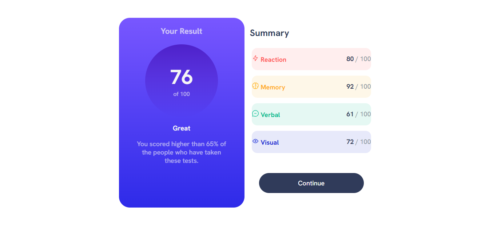

# Frontend Mentor - Results summary component solution

Essa é uma solução para o projeto [Results summary component challenge on Frontend Mentor](https://www.frontendmentor.io/challenges/results-summary-component-CE_K6s0maV). O Frontend Mentor challenges te ajuda a melhorar as suas habilidades construindo  projetos realistas. 

## Table of contents

- [Overview](#overview)
  - [O desafio](#o-desafio)
  - [Screenshot](#screenshot)
- [Meu processo](#meu-processo)
  - [Criado com](#criado-com)
  - [O Que Aprendi](#o-que-aprendi)
  - [Desenvolvimento contínuo](#desenvolvimento-contínuo)
- [Autor](#autor)

## Overview
Você pode acessar o projeto aqui
- Solution URL: [Add solution URL here](https://your-solution-url.com)
### O desafio

O usuários devem conseguir:

- Ver o layout otimizado dependendo do tamanho da tela do seu dispositivo.

- Ver estados de hover ao passar o mouse ou tocar pelo celular.

### Screenshot

## Meu processo

### Criado com

- Marcação HTML5
- Propriedades costumizadas css
- Flexbox
- Workflow Mobile-first

### O Que Aprendi

Centralizar algo dentro de um container

    display: flex;
    justify-content: center;
    align-items: center;

### Desenvolvimento contínuo

Quero adicionar javascript futuramente.

## Autor

- Website - [Davi Damasio](https://github.com/Davi-Damasio)
- Frontend Mentor - [@davi-damasio](https://www.frontendmentor.io/profile/Davi-Damasio)

